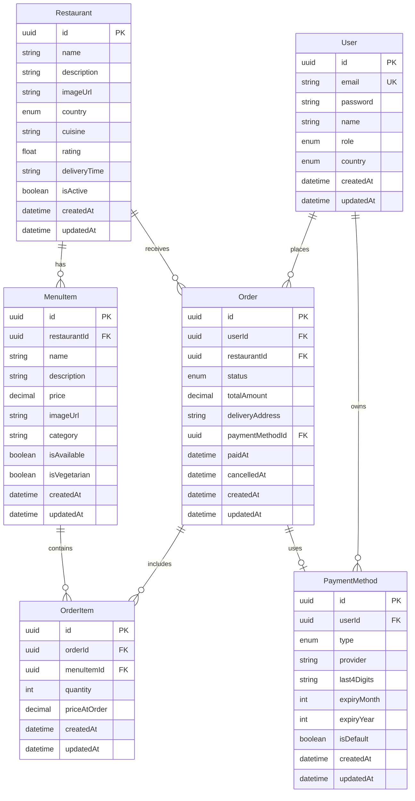

# Database Schema Design
## Slooze Food Ordering Platform

---

## 📊 Entity Relationship Diagram



---

## 📋 Table Specifications

### User Table

**Purpose**: Store user authentication and authorization data

| Column | Type | Constraints | Description |
|--------|------|-------------|-------------|
| id | UUID | PRIMARY KEY | Unique user identifier |
| email | VARCHAR(255) | UNIQUE, NOT NULL | User email for login |
| password | VARCHAR(255) | NOT NULL | Bcrypt hashed password |
| name | VARCHAR(255) | NOT NULL | User's full name |
| role | ENUM | NOT NULL, DEFAULT 'MEMBER' | ADMIN, MANAGER, MEMBER |
| country | ENUM | NOT NULL | INDIA, AMERICA |
| createdAt | TIMESTAMP | NOT NULL, DEFAULT NOW() | Account creation time |
| updatedAt | TIMESTAMP | NOT NULL, AUTO UPDATE | Last update time |

**Indexes**:
- PRIMARY KEY on `id`
- UNIQUE INDEX on `email`
- INDEX on `role` (for role-based queries)
- INDEX on `country` (for country filtering)

**Relationships**:
- One-to-Many with `Order` (can place multiple orders)
- One-to-Many with `PaymentMethod` (Admin can have multiple payment methods)

---

### Restaurant Table

**Purpose**: Store restaurant information

| Column | Type | Constraints | Description |
|--------|------|-------------|-------------|
| id | UUID | PRIMARY KEY | Unique restaurant identifier |
| name | VARCHAR(255) | NOT NULL | Restaurant name |
| description | TEXT | NOT NULL | Restaurant description |
| imageUrl | VARCHAR(500) | NOT NULL | Restaurant image URL |
| country | ENUM | NOT NULL | INDIA, AMERICA |
| cuisine | VARCHAR(100) | NOT NULL | Cuisine type (Indian, American, etc.) |
| rating | DECIMAL(2,1) | DEFAULT 0 | Average rating (0.0 - 5.0) |
| deliveryTime | VARCHAR(50) | NOT NULL | Estimated delivery time (e.g., "30-45 min") |
| isActive | BOOLEAN | DEFAULT TRUE | Whether restaurant is accepting orders |
| createdAt | TIMESTAMP | NOT NULL, DEFAULT NOW() | Creation time |
| updatedAt | TIMESTAMP | NOT NULL, AUTO UPDATE | Last update time |

**Indexes**:
- PRIMARY KEY on `id`
- INDEX on `country` (for country filtering)
- INDEX on `isActive` (to filter active restaurants)

**Relationships**:
- One-to-Many with `MenuItem` (has multiple menu items)
- One-to-Many with `Order` (receives multiple orders)

---

### MenuItem Table

**Purpose**: Store menu items for each restaurant

| Column | Type | Constraints | Description |
|--------|------|-------------|-------------|
| id | UUID | PRIMARY KEY | Unique menu item identifier |
| restaurantId | UUID | FOREIGN KEY, NOT NULL | Reference to Restaurant |
| name | VARCHAR(255) | NOT NULL | Menu item name |
| description | TEXT | NOT NULL | Item description |
| price | DECIMAL(10,2) | NOT NULL | Item price |
| imageUrl | VARCHAR(500) | NOT NULL | Item image URL |
| category | VARCHAR(100) | NOT NULL | Category (Appetizer, Main, Dessert, etc.) |
| isAvailable | BOOLEAN | DEFAULT TRUE | Whether item is available |
| isVegetarian | BOOLEAN | DEFAULT FALSE | Whether item is vegetarian |
| createdAt | TIMESTAMP | NOT NULL, DEFAULT NOW() | Creation time |
| updatedAt | TIMESTAMP | NOT NULL, AUTO UPDATE | Last update time |

**Indexes**:
- PRIMARY KEY on `id`
- INDEX on `restaurantId` (for fetching restaurant menu)
- INDEX on `category` (for category filtering)

**Relationships**:
- Many-to-One with `Restaurant`
- One-to-Many with `OrderItem`

---

### Order Table

**Purpose**: Store order information

| Column | Type | Constraints | Description |
|--------|------|-------------|-------------|
| id | UUID | PRIMARY KEY | Unique order identifier |
| userId | UUID | FOREIGN KEY, NOT NULL | Reference to User who placed order |
| restaurantId | UUID | FOREIGN KEY, NOT NULL | Reference to Restaurant |
| status | ENUM | NOT NULL, DEFAULT 'DRAFT' | DRAFT, PENDING, CONFIRMED, DELIVERED, CANCELLED |
| totalAmount | DECIMAL(10,2) | NOT NULL | Total order amount |
| deliveryAddress | TEXT | NULLABLE | Delivery address (optional for now) |
| paymentMethodId | UUID | FOREIGN KEY, NULLABLE | Reference to PaymentMethod used |
| paidAt | TIMESTAMP | NULLABLE | When payment was completed |
| cancelledAt | TIMESTAMP | NULLABLE | When order was cancelled |
| createdAt | TIMESTAMP | NOT NULL, DEFAULT NOW() | Order creation time |
| updatedAt | TIMESTAMP | NOT NULL, AUTO UPDATE | Last update time |

**Indexes**:
- PRIMARY KEY on `id`
- INDEX on `userId` (for user order history)
- INDEX on `restaurantId` (for restaurant orders)
- INDEX on `status` (for filtering by status)

**Relationships**:
- Many-to-One with `User` (belongs to one user)
- Many-to-One with `Restaurant` (from one restaurant)
- One-to-Many with `OrderItem` (contains multiple items)
- Many-to-One with `PaymentMethod` (uses one payment method)

---

### OrderItem Table

**Purpose**: Store individual items in an order (junction table with additional data)

| Column | Type | Constraints | Description |
|--------|------|-------------|-------------|
| id | UUID | PRIMARY KEY | Unique order item identifier |
| orderId | UUID | FOREIGN KEY, NOT NULL | Reference to Order |
| menuItemId | UUID | FOREIGN KEY, NOT NULL | Reference to MenuItem |
| quantity | INTEGER | NOT NULL, CHECK > 0 | Quantity ordered |
| priceAtOrder | DECIMAL(10,2) | NOT NULL | Price at time of order (snapshot) |
| createdAt | TIMESTAMP | NOT NULL, DEFAULT NOW() | Creation time |
| updatedAt | TIMESTAMP | NOT NULL, AUTO UPDATE | Last update time |

**Indexes**:
- PRIMARY KEY on `id`
- INDEX on `orderId` (for fetching order items)
- INDEX on `menuItemId` (for menu item analytics)

**Relationships**:
- Many-to-One with `Order` (belongs to one order)
- Many-to-One with `MenuItem` (references one menu item)

**Cascade Delete**: When an `Order` is deleted, all associated `OrderItem` records should be deleted

---

### PaymentMethod Table

**Purpose**: Store payment method information (Admin managed)

| Column | Type | Constraints | Description |
|--------|------|-------------|-------------|
| id | UUID | PRIMARY KEY | Unique payment method identifier |
| userId | UUID | FOREIGN KEY, NULLABLE | Reference to User (Admin who created it) |
| type | ENUM | NOT NULL | CREDIT_CARD, DEBIT_CARD, UPI, WALLET |
| provider | VARCHAR(100) | NOT NULL | Visa, Mastercard, PayPal, etc. |
| last4Digits | VARCHAR(4) | NOT NULL | Last 4 digits of card/account |
| expiryMonth | INTEGER | NOT NULL, CHECK 1-12 | Expiry month (for cards) |
| expiryYear | INTEGER | NOT NULL, CHECK >= current year | Expiry year |
| isDefault | BOOLEAN | DEFAULT FALSE | Default payment method |
| createdAt | TIMESTAMP | NOT NULL, DEFAULT NOW() | Creation time |
| updatedAt | TIMESTAMP | NOT NULL, AUTO UPDATE | Last update time |

**Indexes**:
- PRIMARY KEY on `id`
- INDEX on `userId` (for user payment methods)

**Relationships**:
- Many-to-One with `User` (created by Admin)
- One-to-Many with `Order` (used in multiple orders)

---

## 🔐 Access Control Patterns

### Row-Level Security Logic

#### User Country Filtering (Re-BAC)

```sql
-- Restaurants: Users see only restaurants in their country (except ADMIN)
SELECT * FROM restaurants 
WHERE country = :userCountry 
   OR :userRole = 'ADMIN';

-- Orders: Users see only orders from restaurants in their country
SELECT o.* FROM orders o
JOIN restaurants r ON o.restaurantId = r.id
WHERE (r.country = :userCountry OR :userRole = 'ADMIN')
  AND o.userId = :userId;
```

#### Role-Based Filtering

```sql
-- Payment Methods: Only ADMIN can query
SELECT * FROM payment_methods
WHERE :userRole = 'ADMIN';

-- Orders that can be checked out
SELECT * FROM orders
WHERE userId = :userId
  AND status = 'DRAFT'
  AND :userRole IN ('ADMIN', 'MANAGER');
```

---

## 📝 Sample Seed Data

### Users
```typescript
const users = [
  {
    email: 'admin@slooze.xyz',
    name: 'Admin User',
    role: 'ADMIN',
    country: 'INDIA', // Can access all
  },
  {
    email: 'manager.india@slooze.xyz',
    name: 'India Manager',
    role: 'MANAGER',
    country: 'INDIA',
  },
  {
    email: 'manager.america@slooze.xyz',
    name: 'America Manager',
    role: 'MANAGER',
    country: 'AMERICA',
  },
  {
    email: 'member.india@slooze.xyz',
    name: 'Indian Member',
    role: 'MEMBER',
    country: 'INDIA',
  },
  {
    email: 'member.america@slooze.xyz',
    name: 'American Member',
    role: 'MEMBER',
    country: 'AMERICA',
  },
];
```

### Restaurants (India)
```typescript
const indianRestaurants = [
  {
    name: 'Tandoori Delights',
    description: 'Authentic North Indian cuisine',
    country: 'INDIA',
    cuisine: 'North Indian',
    deliveryTime: '30-40 min',
    rating: 4.5,
  },
  {
    name: 'Dosa Palace',
    description: 'South Indian specialties',
    country: 'INDIA',
    cuisine: 'South Indian',
    deliveryTime: '25-35 min',
    rating: 4.7,
  },
  // ... more Indian restaurants
];
```

### Restaurants (America)
```typescript
const americanRestaurants = [
  {
    name: 'Burger Barn',
    description: 'Classic American burgers',
    country: 'AMERICA',
    cuisine: 'American',
    deliveryTime: '20-30 min',
    rating: 4.3,
  },
  {
    name: 'Pizza Paradise',
    description: 'New York style pizzas',
    country: 'AMERICA',
    cuisine: 'Italian-American',
    deliveryTime: '35-45 min',
    rating: 4.6,
  },
  // ... more American restaurants
];
```

### Menu Items
```typescript
const menuItems = [
  // Tandoori Delights (India)
  {
    restaurantId: 'tandoori-delights-id',
    name: 'Butter Chicken',
    description: 'Creamy tomato-based chicken curry',
    price: 299.00,
    category: 'Main Course',
    isVegetarian: false,
  },
  {
    restaurantId: 'tandoori-delights-id',
    name: 'Paneer Tikka',
    description: 'Grilled cottage cheese with spices',
    price: 249.00,
    category: 'Appetizer',
    isVegetarian: true,
  },
  
  // Burger Barn (America)
  {
    restaurantId: 'burger-barn-id',
    name: 'Classic Cheeseburger',
    description: 'Beef patty with cheddar cheese',
    price: 12.99,
    category: 'Main Course',
    isVegetarian: false,
  },
  // ... more items
];
```

### Payment Methods
```typescript
const paymentMethods = [
  {
    type: 'CREDIT_CARD',
    provider: 'Visa',
    last4Digits: '4242',
    expiryMonth: 12,
    expiryYear: 2026,
    isDefault: true,
  },
  {
    type: 'UPI',
    provider: 'Google Pay',
    last4Digits: '9876', // Last 4 of UPI ID
    expiryMonth: 12,
    expiryYear: 2099, // No expiry for UPI
    isDefault: false,
  },
];
```

---

## 🔄 Data Integrity Rules

### Constraints

1. **Email Uniqueness**: No two users can have the same email
2. **Positive Quantity**: OrderItem quantity must be > 0
3. **Valid Price**: Menu item and order prices must be >= 0
4. **Valid Expiry**: Payment method expiry year >= current year
5. **Status Transitions**: Orders can only move through valid status transitions

### Business Rules

1. **Country Consistency**: 
   - User can only order from restaurants in their country (except ADMIN)
   - Orders must reference restaurants in the same country as user

2. **Role Permissions**:
   - Only ADMIN can create/modify/delete PaymentMethod
   - Only ADMIN/MANAGER can set Order.paidAt (checkout)
   - Only ADMIN/MANAGER can set Order.cancelledAt (cancel)

3. **Order Lifecycle**:
   - DRAFT → PENDING (on checkout)
   - PENDING → CONFIRMED (payment success)
   - CONFIRMED → DELIVERED (delivery complete)
   - DRAFT/PENDING → CANCELLED (user/admin cancellation)
   - Cannot cancel CONFIRMED or DELIVERED orders

4. **Price Snapshot**:
   - OrderItem.priceAtOrder captures MenuItem.price at time of order
   - Protects against price changes after order placement

---

## 📊 Sample Queries

### Get Restaurants for User (with Country Filter)
```sql
SELECT * FROM restaurants
WHERE country = 'INDIA'  -- User's country
  AND isActive = true
ORDER BY rating DESC;
```

### Get User's Order History
```sql
SELECT o.*, r.name as restaurantName, r.country
FROM orders o
JOIN restaurants r ON o.restaurantId = r.id
WHERE o.userId = 'user-id'
  AND (r.country = 'INDIA' OR 'ADMIN' = 'ADMIN')  -- Country check
ORDER BY o.createdAt DESC;
```

### Calculate Order Total
```sql
SELECT SUM(oi.priceAtOrder * oi.quantity) as total
FROM order_items oi
WHERE oi.orderId = 'order-id';
```

### Get Menu Items for Restaurant
```sql
SELECT * FROM menu_items
WHERE restaurantId = 'restaurant-id'
  AND isAvailable = true
ORDER BY category, name;
```

---

## 🛠️ Migration Strategy

### Initial Migration
```bash
npx prisma migrate dev --name init
```

Creates all tables with indexes and constraints

### Seed Database
```bash
npx prisma db seed
```

Populates with mock data:
- 5 users (1 Admin, 2 Managers, 2 Members)
- 10 restaurants (5 India, 5 America)
- 50+ menu items
- 5 payment methods

### Reset Database (Development)
```bash
npx prisma migrate reset
```

Drops database, re-runs migrations, re-seeds data

---

## 📈 Scalability Considerations

### Indexes
- All foreign keys indexed for join performance
- `country` and `role` indexed for filtering
- `status` indexed for order queries

### Optimization Opportunities
1. **Materialized Views**: Pre-compute restaurant ratings
2. **Partitioning**: Partition orders by date/country for large datasets
3. **Caching**: Cache restaurant and menu data (rarely changes)
4. **Full-Text Search**: Add search index on restaurant/menu item names

### Future Enhancements
- Add `RestaurantHours` table for operating hours
- Add `Review` table for user reviews
- Add `Promotion` table for discounts
- Add `DeliveryAgent` table for delivery tracking
- Add `Address` table for user delivery addresses

---

**Document Version**: 1.0  
**Last Updated**: January 2026
